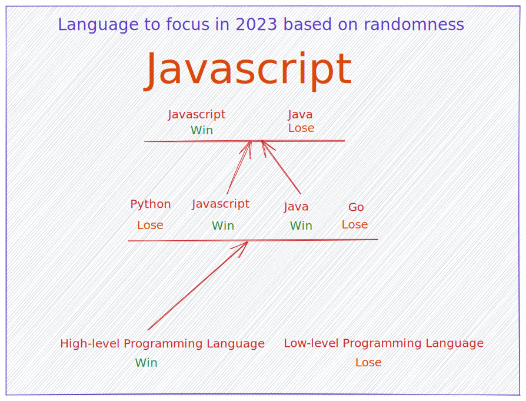
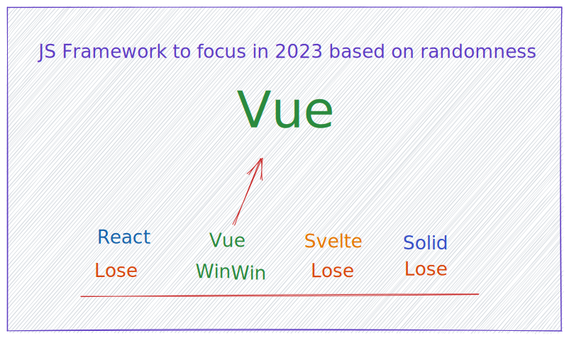

# I will focus on these technologies in 2023

These were chosen via 2 random choice making websites [Textfixer](https://www.textfixer.com/tools/random-choice.php) and [Jklp](http://jklp.org/html/choose.html) \
and these are the results I got. And I will still upload even if it looks like noob code.

## Languages

First I had the choices of picking High or Low level programming languages \
and then I choose 4 different options for languages and since both sites had \
2 different results then I ran the random choice making app again \
and they both resulted in choosing Javascript

 

## Frameworks

Since Javascript was the winner I also made the decision to \
randomly choose a Framework and the results on both websites is Vue.

    <h1>Tech I will be focusing in 2023 is:</h1>

    <section>
        <h1>Language</h1>
        <h2 style="color:#f1e05a; font-weight:600; font-size: 40px;">Javascript</h2> 
        
    </section>
    <section>
        <h1>Framework</h1>
        <h2 style="color:#42b883; font-weight:600; font-size: 40px;">Vue</h2> 
        
    </section>

  

### Sorry if the images looks bad